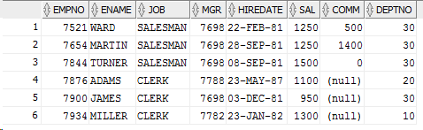

Tema: **Control Minuțios**.
Student: **Curmanschii Anton, IA1901**.

## Introducere

Informația extrasă din [documentarea oficială](https://docs.oracle.com/cd/B28359_01/network.111/b28531/vpd.htm).

Sistemul controlului minuțios în Oracle permite să stabilim reguli de securitate speciale asupra tabelelor.
În scurt, la fiecare interogare emisă de către utilizator se adaugă câte o clauză de filtrare (`where`), invizibilă. 
Conținutul acestei clauze este de obicei stabilit de către administrator de securitate.

De exemplu, se poate restrânge accesul la doar înregistrările create de către un utilizator particular.
De exemplu, Vasea ar dori să găsească toată marfa din tabelul `MARFA`, însă lui se permite să examineze numai marfa produsă de către el. Zicem, că Vasea are id-ul 4, atunci interogarea

```SQL
select * from MARFA
```

se schimbă la 


```SQL
select * from MARFA
    where PRODUCATOR_ID = 4
```

Conținutul acestei clauze de fapt se returnează dintr-o funcție ca text. De exemplu funcția pentru sortare la Vasea va arăta astfel:

```SQL
create or replace function auth_marfa( 
    schema_var in varchar2,
    table_var  in varchar2
)
    return varchar2
    is
    begin
        return 'PRODUCATOR_ID = 4'; /* <--- clauza dorită */
    end auth_marfa;
```

Această funcție poate fi și mai complicată, conținând interogări și orice altă logică.

Aici mai avem un concept util, anume *contextul aplicației*. 
În scurt, el conține informația despre sesiunea curentă. 
Ne interesează în particular id-ul producătorului logat curent.
Evident, așa informație nu există pe context by default, însă putem să-l modificăm când utilizatorul se loghează. 
Putem utiliza acestă informație pentru a selecta id-ul după care se face filtrarea automat pentru fiecare utilizator.
În exemplul nostru este necesar să schimbăm predicatul la `PRODUCATOR_ID = SYS_CONTEXT('producator', 'id')`.

Pentru a aplica clauza la un anumit tabel, se apelează funcția `dbms_rls.add_policy`. (`=>` în oracle denotează *named arguments*).
```SQL
begin
    dbms_rls.add_policy (
        object_schema   => 'cine_a_creat_tabelul_marfa', 
        object_name     => 'marfa', 
        policy_name     => 'auth_marfa_policy', 
        function_schema => 'cine_a_creat_acea_functie',
        policy_function => 'auth_marfa', 
        statement_types => 'select');
end;
```

Această funcție poate fi apelată numai dacă contul de pe care ea se apelează are toate permisiunile necesare.

## Exemplu

În exemplul se cere ca select la tabelul `EMP` al lui `scott` să returneze doar angajații, salariul cărora este mai mic ca 1500.

1. Ne logăm în sqldeveloper ca `sec_admin` (am creat utilizatorul anterior după tutorialul din documentarea Oracle).

2. Creăm următoarea funcție:

```SQL
create or replace function auth_emp(
    p_schema_name in varchar2,
    p_object_name in varchar2
)
    return varchar2
    is
    begin
        return 'SAL <= 1500';
    end auth_emp;
```

3. Ne logăm ca `sysdba` din `sqlplus` utilizând comanda `sqlplus / as sysdba` în consola. 

4. Dăm lui `sec_admin` dreptul să creeze politice: `grant execute on dbms_rls to sec_admin;`.

5. Creăm politica (ca `sec_admin` deja în `sqldeveloper`):

```SQL
begin
    dbms_rls.add_policy (
        object_schema   => 'scott', 
        object_name     => 'emp', 
        policy_name     => 'auth_emp_policy', 
        function_schema => 'sec_admin',
        policy_function => 'auth_emp', 
        statement_types => 'select');
end;
```

6. Verificăm dacă ea lucrează cu iterogarea `select * from scott.emp` dacă lucrează. Am primit un tabel unde salariile sunt mai mici sau egale cu 1500, deci lucrează.




7. Politica creată de către mine se aplică numai la selectarea din tabel EMP, însă aceasta se poate de modificat prin ștergerea a politicii utilizând funcția `dbms_rls.drop_policy()` și specificată din nou cu argumente diferite.

```SQL
begin
    -- Politica se șterge
    dbms_rls.drop_policy(
        object_schema => 'scott', 
        object_name   => 'emp', 
        policy_name   => 'auth_emp_policy'
    );
    -- Politica se adaugă din nou
    dbms_rls.add_policy (
        object_schema   => 'scott', 
        object_name     => 'emp', 
        policy_name     => 'auth_emp_policy', 
        function_schema => 'sec_admin',
        policy_function => 'auth_emp', 
        statement_types => 'select,delete,insert,update');
     /* Tipurile de interogări noi ^^^^^^^^^^^^^^^^^^^^ */
end;
```

8. Însă politica nu se aplică la `sysdba`. Dacă încercăm `select SAL from SCOTT.EMP;`, primim toate valorile:
```
SQL> select sal from scott.emp;

       SAL
----------
   2388.79
      1600
      1250
      2975
      1250
      2850
      2450
      3000
      5000
      1500
      1100

       SAL
----------
       950
      3000
      1300

14 rows selected.
```