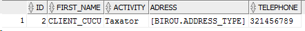
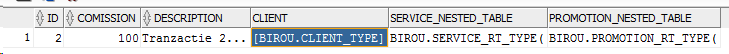

# Lucru Individual nr.2 la SGBD 

A efectuat: **Curmanschii Anton, IA1901**.

Varianta 7, **Biroul notarial**.

## Sarcina

Lucrarea nr.2 se băzează pe lucrarea nr.1. 

În lucrarea nr.1 a fost elaborat aspectul structural al datelor (tabelele).

Lucrarea nr.2 presupune organizația administrativă a sistemului bazei de date, în particular:
1. Crearea utilizatorilor cu regulații diferite (client, notar, șef);
2. Utilizarea contextului de aplicație pentru a determina restrângerile pentru utilizatorul logat;
3. Dezvoltarea setului de reguli potrivite grupurilor de utilizatori;
4. Utilizarea politicelor pentru a stipula aceste reguli.


# Introducere

Am studiat conceptele de **user, profile, role și privilege** și diferențele dintre ele [aici](https://docs.oracle.com/en/database/oracle/oracle-database/19/cncpt/topics-for-database-administrators-and-developers.html#GUID-364F918B-B228-4A42-9F5F-4E430290651E). În scurt:
1. **Privilege** (privilegiu) este un drept la o acțiune specifică (de exemplu, interogarea unui tabel specific);
2. **Role** (rol) este un set de privilegii numit (de exemplu, setul de reguli pentru client, adică interogarea tabelelor specifice etc. ar fi numit `rol_client`).
3. **User** (utilizator) este entitatea ce unește datele de autentificare a unui utilizator specific și setul corespunzător de reguli.
4. **Profile** (profil) specifică cantitatea de resurse alocate unui utilizator.

Deci, în exemplul nostru vom avea:
1. *Privilegiile* de acces la tabele cu tarife și cu tranzacțiile;
2. *Rolurile* pentru `client`, `notar` și `sef` distincte;
3. 3 *utilizatori* (`client_cucu`, `notar_ion` și `sef_vitalie`);
4. Probabil nu voi defini profile-uri;
5. Datorită *controlului minuțios*, vom limita acces la tabele mai precis.


## Crearea tabelelor

La început vom crea tabele cu codul din lucrarea nr.1.

În Oracle, tabelele sunt asociate utilizatorilor, deci la început avem nevoie de cel puțin un utilizator.

Vom crea un cont asociat întregului birou notarial numit `birou` și vom crea tabelele în numele acestui utilizator ([referința](https://docs.oracle.com/cd/B19306_01/network.102/b14266/admusers.htm#i1006856)).

```sql
SQL> create user birou identified by admin;
User created.
SQL> grant create session to birou;
Grant succeeded.
```

Astfel, am creat un utilizator, dar la moment el încă nu are privilegiile de a crea obiecte. 
Vrem ca birou să aibă acces nelimitat la obiectele sale. Pentru această, îi putem da privilegiul `UNLIMITED TABLESPACE`.

```sql
SQL> grant UNLIMITED TABLESPACE to birou;
Grant succeeded.
```

Aceasta încă nu este de ajuns pentru a putea crea obiecte. 
Pentru aceasta, trebuie să-i dăm privilegiile de a crea toate tipurile de obiecte care îi trebuie: `table` (automat se permite și `index`), `procedure` (automat se admit și funcțiile) și `type`. Altceva nu utilizăm.

```sql
SQL> grant create table, create type, create procedure to birou;
Grant succeeded.
```

De menționat, că utilizatorul are automat privilegiile de a adăuga și șterge înregistrări din tabelele create de el, de a apela funcțiile create de el și de a da altor utilizator privilegii de acces la obiectele lui ([sursa](https://blogs.oracle.com/sql/how-to-create-users-grant-them-privileges-and-remove-them-in-oracle-database)). 

Dacă încercăm acum direct să apelăm codul din lab.1, vom observa următoarea greșeală:
```
ORA-00972: identifier is too long
```

În versiunea Oracle ce ne-ați recomandat, identificatorii pot avea o lungime de cel mult 30 de octeți. Numile explicite ale mele sunt uneori de >40 de caractere (`Transaction_Service_Nested_Reference_Table`), deci voi avea nevoie să le prescurtez. De exemplu, prescurtăm *Nested_Reference_Table* la *NRT* și *Reference_Table* la *RT*.

Acum, putem porni codul. Ne asigurăm că tabelele de fapt s-au creat.

4


## Rolurile

Rolurile vor fi următoarele:
- *Clientul* va avea posibilitate de a vedea tranzacțiile începute de el și toate tarifele.
- *Notarul* va avea posibilitate de a vedea orice tranzacție + toate tarifele.
- *Șeful* poate modifica orice tarif și orice tranzacție, poate adăuga tranzacții noi.

Cum a fost menționat, limitarea înregistrărilor particulare din tabel se va realiza prin control minuțios. O vom realiza într-o secțiune aparte.

*Clientul* va avea posibilitatea de a privi orice informație despre tarife și promoții, va avea posibilitatea de a privi informația despre sine din tabelul de clienți și va putea accesa tranzacțiile proprie din tabela de tranzacții.

Nu sunt sigur dacă dereferirea unei referințe la un element dintr-un alt tabel necesită privilegiile de select la acel tabel, însă logic da, deoarece ref și deref în esența pur și simplu ascund id-urile și join-urile pe celălalt tabel.

```sql
create role client_role;
/
grant select on BIROU.service_table to client_role;
/
grant select on BIROU.promotion_table to client_role;
/
grant select on BIROU.client_table to client_role;
/
grant select on BIROU.transaction_table to client_role;
/
```

*Notarul* va avea exact aceleași privilegii, însă nu va fi vizat de politica controlului minuțios.

```sql
create role notar_role;
/
grant select on BIROU.service_table to notar_role;
/
grant select on BIROU.promotion_table to notar_role;
/
grant select on BIROU.client_table to notar_role;
/
grant select on BIROU.transaction_table to notar_role;
/
```

*Șeful* va avea toate privilegii diferite de modificare a acestor tabele.

```sql
create role sef_role;
/
grant select, update, delete, insert on BIROU.service_table to sef_role;
/
grant select, update, delete, insert on BIROU.promotion_table to sef_role;
/
grant select, update, delete, insert on BIROU.client_table to sef_role;
/
grant select, update, delete, insert on BIROU.transaction_table to sef_role;
/
```


## Utilizatorii

Vom crea utilizatorii `client_cucu`, `notar_ion` și `sef_vitalie`.

```sql
SQL> create user client_cucu identified by admin;    
User created.                                        
                                                     
SQL> create user notar_ion identified by admin;      
User created.                                        
                                                     
SQL> create user sef_vitalie identified by admin;    
User created.                                        
```

Am dat șefului și un tablespace cu o cuotă de 100M:

```sql
SQL> alter user sef_vitalie default tablespace example quota 100M on example;
User altered.
```

Acum distribuim rolurile:
```sql
SQL> grant client_role to client_cucu;  
Grant succeeded.                        
                                        
SQL> grant notar_role to notar_ion;     
Grant succeeded.                        
                                        
SQL> grant sef_role to sef_vitalie;     
Grant succeeded.                        
```

Le dăm și posibilitatea de a loga:
```sql
SQL> grant create session to client_cucu;
Grant succeeded.

SQL> grant create session to notar_ion;
Grant succeeded.

SQL> grant create session to sef_vitalie;
Grant succeeded.
```


## Contextul

Ne vom loga ca `sec_admin` și vom aplica regulile băzate pe rolurile notarului și a clientului.

Vom folosi contextul de aplicație pentru a stoca ce roluri are persoana logată.
Aceste date nu există by default pe contextul aplicației ([sursa](https://docs.oracle.com/en/database/oracle/oracle-database/18/sqlrf/SYS_CONTEXT.html#GUID-B9934A5D-D97B-4E51-B01B-80C76A5BD086)).
Deci trebuie să le găsim și stocăm manual. 

Informația despre roluri poate fi găsită în tabelul `USER_ROLE_PRIVS` ([sursa](https://stackoverflow.com/questions/15066408/how-to-find-the-privileges-and-roles-granted-to-a-user-in-oracle)). Deci pentru a stoca această informație vom crea un trigger pe login care va lua informația respectivă din baza de date și o va pune în context.

Deci la început se creează o funcție folosită la pregătirea contextului. Important: valorile rolurilor trebuie fi scrise cu litere majuscule! `USER_ROLE_PRIVS` nu a lucrat pentru mine, nu știu de ce anume. Însă putem utiliza `DBA_ROLE_PRIVS` specificând și numele utilizatorului.

```sql
create or replace package User_Roles_Context_Package
    is 
    procedure set_user_role;
end;
/
create or replace package body User_Roles_Context_Package 
    is
    procedure set_user_role
        is
            user_role varchar2(20);
        begin
            select GRANTED_ROLE 
                into user_role
                from DBA_ROLE_PRIVS       
                where grantee = SYS_CONTEXT('USERENV', 'SESSION_USER')
                and GRANTED_ROLE in ('CLIENT_ROLE', 'NOTAR_ROLE', 'SEF_ROLE');
            dbms_session.set_context('user_roles_context', 'user_role', user_role);
        exception  
            when no_data_found then null;
    end;
end;
/
```

Acum creăm (registrăm) contextul:
```sql
create or replace context user_roles_context using User_Roles_Context_Package;
/
```

Acum se creează triggerul menționat anterior:
```sql
create or replace trigger User_Roles_Context_Trigger after logon on database
    begin
        sec_admin.User_Roles_Context_Package.set_user_role;
    end;
/
```

Verificăm, dacă lucrează. Ne logăm ca `client_cucu` și ne uităm dacă valoarea rolului pe context este corectă:
```sql
select SYS_CONTEXT('user_roles_context', 'user_role') r from dual;
```

Exemplul afișează valoarea corectă de `client_role`.


## Control minuțios

Vom defini o politică de securitate pentru clienți:
1. El poate vedea numai informația despre el din tabelul de clienți;
2. Tabelul de tranzacții ar putea fi accesat numai pentru tranzacțiile acestui client.

Deci, ne logăm ca `sec_admin`. Descriem o funcție ce reprezintă politica de securitate, returnând predicatul de filtrare. Evident, această funcție va lucra corect numai dacă username-ul utilizatorului este același ca și `first_name`, specificat în tabela:

```sql
create or replace function auth_clients( 
    schema_var in varchar2,
    table_var  in varchar2
)
    return varchar2
    is
        v_role varchar2(20);
    begin

        v_role := SYS_CONTEXT('user_roles_context', 'user_role');

        if (v_role = 'CLIENT_ROLE') then
            return 'UPPER(FIRST_NAME) = ''' || SYS_CONTEXT('USERENV', 'SESSION_USER') || '''';
        end if;

        return '1=1';

    end auth_clients;
/
```

După ce creăm politica:
```sql
begin
    dbms_rls.add_policy(
        object_schema   => 'birou', 
        object_name     => 'client_table', 
        policy_name     => 'select_client_policy', 
        function_schema => 'sec_admin',
        policy_function => 'auth_clients', 
        statement_types => 'select'
    );
end;
/
```

La moment, tabelul nu conține nici o înregistrare, numele la care să fie `client_cucu` (avem doar `Cucu`). Deci, vom schimba `first_name` lui `Cucu` la `client_cucu`.

```sql
SQL> update birou.client_table set first_name = 'client_cucu' where first_name = 'Cucu';
1 row updated.
```

Acum verificăm următoarea interogare, deja logar ca `client_cucu`:
```sql
select * from BIROU.client_table
```

Ne afișează numai informația despre clientul, numele căruia este `client_cucu`:



Acum creăm o funcție pentru tabelul de tranzacții, după ce creăm o politică și îi asociem această funcție:

```sql
create or replace function auth_transaction( 
    schema_var in varchar2,
    table_var  in varchar2
)
    return varchar2
    is
        v_role varchar2(20);
    begin

        v_role := SYS_CONTEXT('user_roles_context', 'user_role');

        if (v_role = 'CLIENT_ROLE') then
            return 'UPPER(DEREF(TRANSACTION_TABLE.CLIENT).FIRST_NAME) = ''' || SYS_CONTEXT('USERENV', 'SESSION_USER') || '''';
        end if;

        return '1=1';

    end auth_transaction;
/
begin
    dbms_rls.add_policy(
        object_schema   => 'birou', 
        object_name     => 'transaction_table', 
        policy_name     => 'select_transaction_policy', 
        function_schema => 'sec_admin',
        policy_function => 'auth_transaction', 
        statement_types => 'select'
    );
end;
/
```

Verificăm:

```sql
select * from BIROU.transaction_table
```

