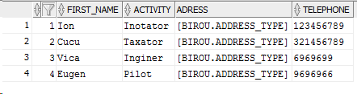

# Lucru Individual nr.2 la SGBD 

A efectuat: **Curmanschii Anton, IA1901**.

Varianta 7, **Biroul notarial**.

## Sarcina

Lucrarea nr.2 se băzează pe lucrarea nr.1. 

În lucrarea nr.1 a fost elaborat aspectul structural al datelor (tabelele).

Lucrarea nr.2 presupune organizația administrativă a sistemului bazei de date, în particular:
1. Crearea utilizatorilor cu regulații diferite (client, notar, șef);
2. Utilizarea contextului de aplicație pentru a determina restrângerile pentru utilizatorul logat;
3. Dezvoltarea setului de reguli potrivite grupurilor de utilizatori;
4. Utilizarea politicelor pentru a stipula aceste reguli.


# Introducere

Am studiat conceptele de **user, profile, role și privilege** și diferențele dintre ele [aici](https://docs.oracle.com/en/database/oracle/oracle-database/19/cncpt/topics-for-database-administrators-and-developers.html#GUID-364F918B-B228-4A42-9F5F-4E430290651E). În scurt:
1. **Privilege** (privilegiu) este un drept la o acțiune specifică (de exemplu, interogarea unui tabel specific);
2. **Role** (rol) este un set de privilegii numit (de exemplu, setul de reguli pentru client, adică interogarea tabelelor specifice etc. ar fi numit `rol_client`).
3. **User** (utilizator) este entitatea ce unește datele de autentificare a unui utilizator specific și setul corespunzător de reguli.
4. **Profile** (profil) specifică cantitatea de resurse alocate utilizatorului.

Deci, în exemplul nostru vom avea:
1. *Privilegiile* de acces la tabele cu tarife și cu tranzacțiile;
2. *Rolurile* pentru `client`, `notar` și `sef` distincte;
3. 3 *utilizatori* (`client_oleg`, `notar_ion` și `sef_vitalie`);
4. Probabil nu voi defini profile-uri;
5. Datorită *controlului minuțios*, vom limita acces la tabele mai precis.


## Crearea tabelelor

La început vom crea tabele cu codul din lucrarea nr.1.

În Oracle, tabelele sunt asociate utilizatorilor, deci la început avem nevoie de cel puțin un utilizator.

Vom crea un cont asociat întregului birou notarial numit `birou` și vom crea tabelele în numele acestui utilizator ([referința](https://docs.oracle.com/cd/B19306_01/network.102/b14266/admusers.htm#i1006856)).

```sql
SQL> create user birou identified by admin;
User created.
SQL> grant create session to birou;
Grant succeeded.
```

Astfel, am creat un utilizator, dar la moment el încă nu are privilegiile de a crea obiecte. 
Vrem ca birou să aibă acces nelimitat la obiectele sale. Pentru această, îi putem da privilegiul `UNLIMITED TABLESPACE`.

```sql
SQL> grant UNLIMITED TABLESPACE to birou;
Grant succeeded.
```

Aceasta încă nu este de ajuns pentru a putea crea obiecte. 
Pentru aceasta, trebuie să-i dăm privilegiile de a crea toate tipurile de obiecte care îi trebuie: `table` (automat se permite și `index`), `procedure` (automat se admit și funcțiile) și `type`. Altceva nu utilizăm.

```sql
SQL> grant create table, create type, create procedure to birou;
Grant succeeded.
```

De menționat, că utilizatorul are automat privilegiile de a adăuga și șterge înregistrări din tabelele create de el, de a apela funcțiile create de el și de a da altor utilizator privilegii de acces la obiectele lui ([sursa](https://blogs.oracle.com/sql/how-to-create-users-grant-them-privileges-and-remove-them-in-oracle-database)). 

Dacă încercăm acum direct să apelăm codul din lab.1, vom observa următoarea greșeală:
```
ORA-00972: identifier is too long
```

În versiunea Oracle ce ne-ați recomandat, identificatorii pot avea o lungime de cel mult 30 de octeți. Numile explicite ale mele sunt uneori de >40 de caractere (`Transaction_Service_Nested_Reference_Table`), deci voi avea nevoie să le prescurtez. De exemplu, prescurtăm *Nested_Reference_Table* la *NRT* și *Reference_Table* la *RT*.

Acum, putem porni codul. Ne asigurăm că tabelele de fapt s-au creat.



S-au mai creat tabelele pentru tranzacții și promoții, însă ele sunt obiectuale și nu arată clar ca acest tabel.


## Rolurile

Rolurile vor fi următoarele:
- *Clientul* va avea posibilitate de a vedea tranzacțiile începute de el și toate tarifele.
- *Notarul* va avea posibilitate de a vedea orice tranzacție + toate tarifele.
- *Șeful* poate modifica orice tarif și orice tranzacție, poate adăuga tranzacții noi.

Cum a fost menționat, limitarea înregistrărilor particulare din tabel se va realiza prin control minuțios. O vom realiza într-o secțiune aparte.

*Clientul* va avea posibilitate de a privi orice informație despre tarife și promoții, va avea posibilitate de a privi informația despre sine din tabelul de clienți și va putea accesa tranzacțiile proprie din tabela de tranzacții.

Nu sunt sigur dacă dereferirea unei referințe la un element dintr-un alt tabel necesită privilegiile de select la acel tabel, însă logic da, deoarece ref și deref în esența pur și simplu ascund id-urile și join-urile pe celelalt tabel.

```sql
create role client_role;
/
grant select on BIROU.service_table to client_role;
/
grant select on BIROU.promotion_table to client_role;
/
grant select on BIROU.client_table to client_role;
/
grant select on BIROU.transaction_table to client_role;
/
```

*Notarul* va avea exact aceleași privilegii, însă nu va fi vizat de politica controlului minuțios.

```sql
create role notar_role;
/
grant select on BIROU.service_table to notar_role;
/
grant select on BIROU.promotion_table to notar_role;
/
grant select on BIROU.client_table to notar_role;
/
grant select on BIROU.transaction_table to notar_role;
/
```

*Șeful* va avea toate privilegii diferite de modificare a acestor tabele.

```sql
create role sef_role;
/
grant select, update, delete, insert on BIROU.service_table to sef_role;
/
grant select, update, delete, insert on BIROU.promotion_table to sef_role;
/
grant select, update, delete, insert on BIROU.client_table to sef_role;
/
grant select, update, delete, insert on BIROU.transaction_table to sef_role;
/
```

## Control minuțios


## Utilizatorii