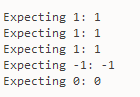

# SGBD Laborator 1.2

A realizat: **Curmanschii Anton, IA1901**.

## Ex.1


```sql
drop table Apartament;
/
drop table Proprietar;
/
drop table Address;
/

drop type tip_apartament;
/
drop type tip_proprietar;
/
drop type tip_adresa2;
/

create type tip_adresa2 as object (
    strada 	varchar2(20),
    numar 	varchar2(5),
    oras 	varchar2(20),
    tara 	varchar2(20),
    MEMBER PROCEDURE afisare
);
/

create type body tip_adresa2 as
    member PROCEDURE afisare
    is 
    begin
        dbms_output.put_line(
               'strada: '        || strada
            || ', numar casei: ' || numar
            || ', orasul: '      || oras
            || ', tara: '        || tara);
    end;
end;
/

create type tip_proprietar as object (
    nume 	varchar2(20),
    prenume varchar2(20),
    data_de_nastere date,
    MEMBER FUNCTION varsta return number
);
/

create type body tip_proprietar as
    member function varsta
    return number
    is
    begin
        return months_between(sysdate, data_de_nastere) / 12;
    end;
end;
/

create type tip_apartament as object
(
    adresa      tip_adresa2,
    proprietar  tip_proprietar,
    tip_apart   varchar2(32),
    etaj        number(2),
    pret        number(10)
);
/

create table Proprietar of tip_proprietar;
/

create table Address of tip_adresa2;
/

create table Apartament of tip_apartament;
/

insert into Apartament values(
    tip_apartament(
        tip_adresa2('str.Stefan', '123', 'Stefan', 'RM'),
        tip_proprietar('Vasea', 'Ion', TO_DATE('10.10.2000', 'dd.mm.yyyy')),
        'villa', 0, 10000
    )
);
/

insert into Proprietar values(
    tip_proprietar('Vasea', 'Ion', TO_DATE('10.10.2000', 'dd.mm.yyyy'))
);
/
```

Am executat acest cod cu succes.


Urmeaza interogarile intr-un bloc anonim.

```sql
declare
    propr tip_proprietar;
    apart tip_apartament;
begin 
    select value(ap)
        into apart
        from Apartament ap
        where ap.adresa.strada = 'str.Stefan';

    apart.adresa.afisare();

    select value(pr)
        into propr
        from Proprietar pr
        where pr.nume = 'Vasea';

    dbms_output.put_line(propr.nume);
end;
```

```
strada: str.Stefan, numar casei: 123, orasul: Stefan, tara: RM
Vasea
```

## Ex.2


```sql
create or replace type tip_apartament2 as object 
(
    tip_apart varchar2(32),
    pret      number(10),
    member function valoarea_tipului return number,
    order member function order_func(other tip_apartament2) return number
);
/

create or replace type body tip_apartament2 as
    member function valoarea_tipului return number
    is begin
        if (tip_apart = 'vila') then
            return 4;
        elsif (tip_apart = 'casa') then
            return 3;
        elsif (tip_apart = 'apartament') then
            return 2;
        elsif (tip_apart = 'camin') then
            return 1;
        else
            return 0;
        end if;
    end;

    order member function order_func(other tip_apartament2)
    return number
    is begin
        if (pret = other.pret) then
            return sign(valoarea_tipului() - other.valoarea_tipului());
        else
            return sign(pret - other.pret);
        end if;
    end;
end;
/
```


Executam codul cu un bloc anonim.

```sql

declare
    vila_5     tip_apartament2 := tip_apartament2('vila', 5);
    camin_5    tip_apartament2 := tip_apartament2('camin', 5);
    apart_10   tip_apartament2 := tip_apartament2('apart', 10);
    apart_10_2 tip_apartament2 := tip_apartament2('apart', 10);
begin
    dbms_output.put_line('Expecting 1: ' || vila_5.order_func(camin_5));    
    dbms_output.put_line('Expecting 1: ' || apart_10.order_func(vila_5));    
    dbms_output.put_line('Expecting 1: ' || apart_10.order_func(camin_5));    
    dbms_output.put_line('Expecting -1: ' || camin_5.order_func(vila_5));    
    dbms_output.put_line('Expecting 0: ' || apart_10.order_func(apart_10_2));    
end;
```

