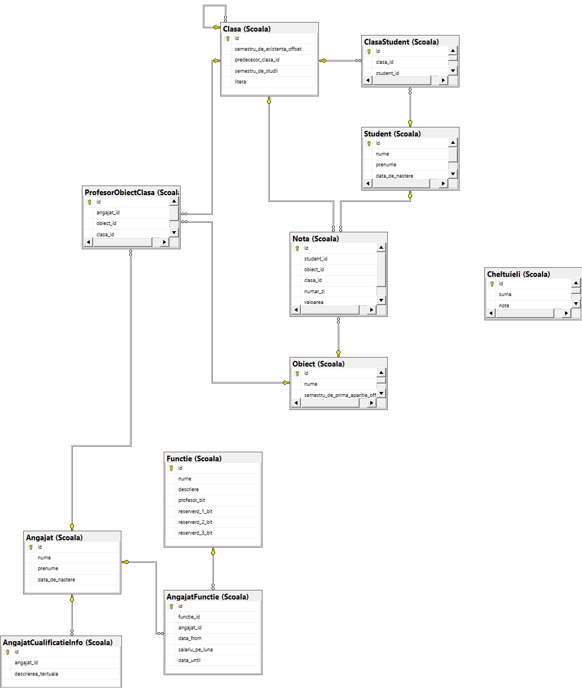

# Lucrul individual la Securitatea Bazelor de Date

A realizat: **Curmanschii Anton, IA1901.**

Tema: **Școală**.

- [Lucrul individual la Securitatea Bazelor de Date](#lucrul-individual-la-securitatea-bazelor-de-date)
  - [1\. De descris activitatea entității economice/sociale/de învățământ.](#1-de-descris-activitatea-entității-economicesocialede-învățământ)
  - [2\. De stabilit scopul realizării Bazei de Date.](#2-de-stabilit-scopul-realizării-bazei-de-date)
  - [3\. De proiectat Baza de Date (cel puțin 8 tabele) și de evidențiat potențialii utilizatori ai BD.](#3-de-proiectat-baza-de-date-cel-puțin-8-tabele-și-de-evidențiat-potențialii-utilizatori-ai-bd)
  - [4\. De argumentat și de creat 3 identificatori și respectiv 3 utilizatori.](#4-de-argumentat-și-de-creat-3-identificatori-și-respectiv-3-utilizatori)
  - [5\. De implementat restricțiile NOT NULL, UNIQUE, CHECK, PRIMARY KEY și FOREIGN KEY.](#5-de-implementat-restricțiile-not-null-unique-check-primary-key-și-foreign-key)
  - [6\. Creați 3 vederi.](#6-creați-3-vederi)
  - [7\. Setați la nivelul unei tabele auditul la modificarea datelor (Insert, Update, Delete).](#7-setați-la-nivelul-unei-tabele-auditul-la-modificarea-datelor-insert-update-delete)
  - [8\. Setați la nivel de BD auditul logon, auditul activității DDL, auditul erorilor, auditul modificării privilegiilor și utilizatorilor.](#8-setați-la-nivel-de-bd-auditul-logon-auditul-activității-ddl-auditul-erorilor-auditul-modificării-privilegiilor-și-utilizatorilor)
  - [9\. Elaborați unui plan de creare a copiilor de rezervă și restabilire a datelor având în vedere specificul BD realizate.](#9-elaborați-unui-plan-de-creare-a-copiilor-de-rezervă-și-restabilire-a-datelor-având-în-vedere-specificul-bd-realizate)

## 1\. De descris activitatea entității economice/sociale/de învățământ.

- Predă lecții studenților.
- Angajează profesorii pentru predare a temelor.
- Administrează bugetul. Școala poate fi susținută de guvern sau una privată. În această lucrare se consideră o școală susținută de guvern.
- Realizează testarea studenților conform standardelor naționale. Realizează examinarea obligatorie.
- Realizează olimpiade și concursuri interne pentru selectarea studenților care pretind să participe în concursuri la nivel de raion.
- Realizează evenimente publice, ca primul apel.


## 2\. De stabilit scopul realizării Bazei de Date.

Baza de date este necesară pentru stocarea listei studenților, obiectelor, profesoarelor, notelor la lecții și la examene, rezultatelor la olimpiade, informații contabile.


## 3\. De proiectat Baza de Date (cel puțin 8 tabele) și de evidențiat potențialii utilizatori ai BD.

Utilizatorii:

- *Profesorii* care înscriu notele în catalog;
- *Părinții* care vor să găsească notele copiilor săi;
- *Administrarea contabilă* care administrează cheltuielile de buget de la guvern (начисление бюджета), cheltuielile din partea școlii (reparații, actualizarea echipamentelor pentru predare);
- *Publicul* care dorește să cunoască despre studenții eminenți.
- *Administrarea* care adaugă studenții, angajații, obiectele, etc.

<!-- Tabelele:
1. Studenții(nume, prenume, anul nasterii), clasa fiind id-ul;
2. Angajații(nume, prenume, anul nasterii, rol);
3. ProfesorCualificatieInfo(Angajat -> anul de studii, Informații despre cualificatia profesorului);
4. ProfesorCePreda(Profesor -> obiect, clasa), anul de studii se deduce usor din clasa;
5. Cheltuielile(sursa, suma, data);
6. Clasa(an de studii, anul epocii, numar, profesorul de clasa); 
7. ClasaStudentiiInfo(Clasa -> Student);
7. StudentObiectInfo(Student -> Obiect);
8. ExamenNotele(student, examen, nota);
9. Examen(nume, obiect, data), clasa asociată poate fi aflată după orice student care a susținut examenul, anul de studii tot;
10. Obiectele(nume);
11. Notele(student, obiect, nota, data); -->

Vedeți fișierul *tables.sql*.



## 4\. De argumentat și de creat 3 identificatori și respectiv 3 utilizatori.

**Rolurile:**

1. *Contabilitate* poate modifica datele referitoare la cheltuieli.
2. *Administrator de recrutare* poate modifica datele referitoare la angajați (presupunem că directorul face recrutarea).
2. *Administrator de admitere* poate modifica datele referitoare la studenți (presupunem că directorul admite studenții).
3. *Administrator de profesori* atribuie profesori la clase.
4. *Profesor* poate adăuga notele în registrul electronic (tabelul Notele) (cu restricția aparținerii la clasa, dar nu realizez această constrângere).
5. *Administratorul de (atribuire a persoanelor la) clase* poate asocia studenți la clase, crea clasele noi.
<!-- 5. *Examinator* poate crea examene și asocia note la examene la studenții pe care i-au predat. -->

Vedeți fișierul *roles.sql*.


**Utilizatorii:**

1. Directorul *Vasilie* are control asupra angajamentului, privilegii de vizualizare publice, are control asupra distribuirii între clase.
2. Contabilul *Gheorghe* are control asupra cheltuielilor.
3. Profesoara *Mariana* are control asupra notelor (la obiectul său, nu-i implementat). 
<!-- , dar poate și crea examene pentru obiectul său. -->

Vedeți fișierul *users.sql*.


## 5\. De implementat restricțiile NOT NULL, UNIQUE, CHECK, PRIMARY KEY și FOREIGN KEY.

Vedeți punctul 3.


## 6\. Creați 3 vederi.

1) care conține coloane din două tabele;
2) care conține coloane din 3 tabele;
3) care conține coloane din 3 tabele cu condiții de filtrare a conținutului coloanelor.

Vedeți fișierul *views.sql* pentru comenzi legate de crearea vederilor.

```sql
select * from Scoala.ClasaStudenti_SemestrulCurent
```

| semestru | clasa | student_nume | student_prenume |
|----------|-------|--------------|-----------------|
| 6        | 3C    | Ashley       | Fiona           |
| 19       | 9B    | Dominguez    | Louise          |
| 8        | 4A    | Villanueva   | Christopher     |
| 22       | 11A   | Jacobs       | Hugh            |
| 13       | 6A    | Key          | Elaine          |
| 21       | 10B   | Thornton     | Tracey          |
| 18       | 9A    | Garza        | Anthony         |
| 2        | 1A    | Evans        | Grant           |


```sql
select * from Scoala.ClasaStudenti_SemestrulCurent
```

| student_nume | student_prenume | obiect_nume                                | nota_medie |
|--------------|-----------------|--------------------------------------------|------------|
| Acevedo      | Jacqueline      | Consumer Math                              | 1          |
| Acosta       | Kirsty          | Earth Science                              | 10         |
| Adkins       | Peter           | Art                                        | 9          |
| Adkins       | Peter           | Computer Science or Lab                    | 4          |
| Aguilar      | Garry           | English                                    | 9          |
| Allen        | Ewan            | Algebra                                    | 9          |
| Allison      | Stewart         | Art                                        | 2          |
| Allison      | Stewart         | Consumer Math                              | 10         |
| Alvarez      | Karen           | Instrumental Music – specific instrument | 8          |
| Alvarez      | Paula           | Health                                     | 2          |


```sql
select * from Scoala.ProfesoriiAngajatiCurent
```

| angajat_id | profesor_nume | profesor_prenume | functii                                                     | salariu_pe_luna |
|------------|---------------|------------------|-------------------------------------------------------------|-----------------|
| 1          | Waters        | Darren           | scientistscientist; auditor; paramedic                      | 8610.00         |
| 2          | Brewer        | Julie            | messenger; scientistscientist                               | 6179.00         |
| 4          | Mcintyre      | Jane             | mining engineer; strategic partnership liaison              | 6087.00         |
| 5          | Berry         | Stewart          | scientistscientist; marine engineer                         | 5859.00         |
| 8          | Mathews       | Graham           | parking lot attendant; early childhood education consultant | 3421.00         |
| 9          | Bowers        | Diane            | consent specialist; strategic partnership liaison           | 5160.00         |
| 10         | Farmer        | Raymond          | manager                                                     | 2976.00         |

## 7\. Setați la nivelul unei tabele auditul la modificarea datelor (Insert, Update, Delete).

Vedeți fișierul *triggers.sql*.

## 8\. Setați la nivel de BD auditul logon, auditul activității DDL, auditul erorilor, auditul modificării privilegiilor și utilizatorilor.

Vedeți fișierul *triggers.sql*.

## 9\. Elaborați unui plan de creare a copiilor de rezervă și restabilire a datelor având în vedere specificul BD realizate.

Trebuie să facem copiile notelor din semestrul curent, zicem, o dată pe lună.
Motivul este că informația aceasta:

a. nu-i critică;
b. poate fi restabilită din memorie dacă se pierde.

Datorită faptului că obiectele existente din baza de date este în multe aspecte readonly, putem face copii incrementale, făcând o copie numai la informații din semestrul curent.
În cazurile rare când se schimbă un nume al angajatului, putem face micro-editări la copii existente.

Ceea ce-i referitor la cheltuielile, aceasta informația probabil este mai sensibilă și trebuie de făcut copii mai des.
Dar aceeasta iarăși depinde de felul de tranzacții realizate și mărimea școlii.
