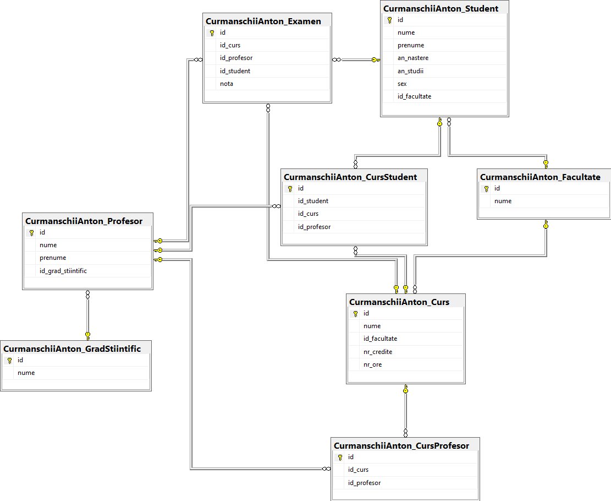

# Laborator 1 la Securitatea BD

A elaborat: **Curmanschii Anton, IA1901.**

Tema: **Managementul accesului la BD.**


## Sarcinile

- Creați baza de date "Universitate".

- Pentru baza de date creată îndepliniți următoarele:
  1. Creați 4 identificatori: X_id1, X_id2, X_id3, X_id4 pentru baza de date X_univer;
  2. Modificați parola pentru identificatorul X_id1;
  3. Afișați lista tuturor identificatorilor;
  4. Utilizând cei 4 identificatori, creați 4 utilizatori respectiv: X_bd1, X_bd2, X_bd3, X_bd4;
  5. Utilizatorului X_bd1 acordați privilegiul Select, Insert, Update și Delete pentru tabelul
  X_Student, X_Profesor și X_Facultate;
  6. Crează rolul X_rol1 cu privilegiul Select, Insert și Update pentru tabelele X_Curs,
  X_Curs_Student, X_Examen;
  7. Crează rolul X_rol2 cu privilegiul Select, Insert și Update pentru tabelele X_Grad_Stiintific și
  X_Profesor;
  8. Asignează rolul X_rol1 și X_rol2 utilizatorului X_bd2;
  9. Creazărolul X_rol3 cu privilegiile Select și Update pentru tabelele X_Student și X_Profesor;
  10. Asignează rolul X_rol3 utilizatorului X_bd3;
  11. Revocă utilizatorului X_bd1 privilegiul Delet și Update pentru tabelul X_Profesor;
  12. Crează rolul X_rol4 cu privilegiul Insert și Update pentru tabelul X_Examen;
  13. Asignează rolul X_rol4 utilizatorului X_bd4;
  14. Acordă utilizatorului X_bd4 privilegiul Select pentru tabelul X_Examen și X_Student;
  15. Utilizatorului X_bd4 scoate dreptul Insert pentru tabelul X_Examen;
  16. Afișază rolurile utilizatorului X_bd2;
  17. Exclude rolul X_rol1 de la utilizatorul X_bd2;
  18. Șterge rolul X_rol1.


## Realizarea

> Creați baza de date "Universitate".

Mă orientez după informații din [următorul articol din documentația MS](https://docs.microsoft.com/en-us/sql/t-sql/lesson-1-creating-database-objects?view=sql-server-ver15).

Utilizând comanda `create database` putem crea o bază de date:

```sql
create database Universitate
```

Verificăm lista bazelor de date prin comanda `exec sp_databases`. 
Vedem baza de date nouă în lista, deci comanda a lucrat corect.

|   | DATABASE_NAME | DATABASE_SIZE | REMARKS |
|---|---------------|---------------|---------|
| 1 | master        | 6592          | NULL    |
| 2 | model         | 16384         | NULL    |
| 3 | msdb          | 15872         | NULL    |
| 4 | tempdb        | 40960         | NULL    |
| 5 | Universitate  | 16384         | NULL    |


Acum creăm tabelele:

```sql
use Universitate
go

create table CurmanschiiAnton_Student(
    id          int primary key not null,
    nume        nvarchar(50) not null,
    prenume     nvarchar(50) not null,
    an_nastere  date not null,
    an_studii   tinyint not null,
    sex         char(1) null)
go

create table CurmanschiiAnton_Facultate(
    id          int primary key not null,
    nume        nvarchar(50) not null)
go

create table CurmanschiiAnton_GradStiintific(
    id          int primary key not null,
    nume        nvarchar(50) not null)
go

create table CurmanschiiAnton_Profesor(
    id                  int primary key not null,
    nume                nvarchar(50) not null,
    prenume             nvarchar(50) not null,
    id_grad_stiintific  int foreign key references CurmanschiiAnton_GradStiintific(id) not null)
go

create table CurmanschiiAnton_Curs(
    id           int primary key not null,
    nume         nvarchar(50) not null,
    id_facultate int foreign key references CurmanschiiAnton_Facultate(id) not null)
go

create table CurmanschiiAnton_CursProfesor(
    id          int primary key not null,
    id_curs     int foreign key references CurmanschiiAnton_Curs(id) not null,
    id_profesor int foreign key references CurmanschiiAnton_Profesor(id) not null)
go

create table CurmanschiiAnton_Examen(
    id          int primary key not null,
    id_curs     int foreign key references CurmanschiiAnton_Curs(id) not null,
    id_profesor int foreign key references CurmanschiiAnton_Profesor(id) not null,
    id_student  int foreign key references CurmanschiiAnton_Student(id) not null,
    nota        tinyint not null)
go

create table CurmanschiiAnton_CursStudent(
    id          int primary key not null,
    id_student  int foreign key references CurmanschiiAnton_Student(id) not null,
    id_curs     int foreign key references CurmanschiiAnton_Curs(id) not null,
    id_profesor int foreign key references CurmanschiiAnton_Profesor(id) not null)
go
```


Diagrama de dependențe rezultantă:



https://docs.microsoft.com/en-us/sql/relational-databases/tutorial-signing-stored-procedures-with-a-certificate?view=sql-server-ver15#1-configure-the-environment