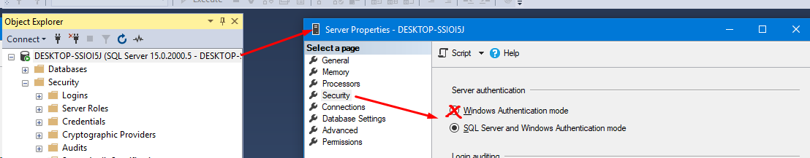
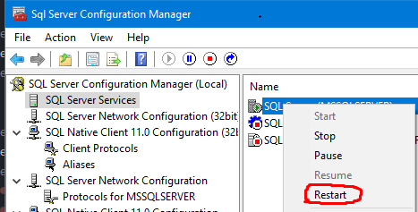

# Laborator 2 la Securitatea BD

A elaborat: **Curmanschii Anton, IA1901.**

Tema: **Metode de audit a BD.**


## Sarcinile

1. Setați la tabelul CurmanschiiAnton_Student și CurmanschiiAnton_Profesor auditul la modificarea datelor (Insert, Update, Delete).
2. Setați la nivel de SQL Server auditul logon.
3. Setați la nivel de BD auditul activității DDL ce presupune modificarea schemei tabelelor
(adaugarea/modificare unei coloane, adaogarea/modificarea unei condiții de integritate).
4. Setați la nivel de BD auditul erorilor.
5. Setați la nivel de BD auditul modificării privilegiilor și utilizatorilor.


## Răspunsurile


### 1\. Setați la tabelul CurmanschiiAnton_Student și CurmanschiiAnton_Profesor auditul la modificarea datelor (Insert, Update, Delete).

Vom crea o tabelă care să țină datele, înregistrate când are loc orice interogare de tip `Insert, Update, Delete` pe tabelele CurmanschiiAnton_Student și CurmanschiiAnton_Profesor.
În primul rând consultăm documentația pentru a afla ce proprietăți putem accesa, ce informație avem la dispoziție într-un astfel de trigger. [Link la pagina documentației](https://docs.microsoft.com/en-us/sql/relational-databases/triggers/dml-triggers?view=sql-server-ver15).

<!-- clr triggers:
     https://sqlquantumleap.com/2017/08/07/sqlclr-vs-sql-server-2017-part-1-clr-strict-security/ -->
<!-- https://sqlquantumleap.com/2017/08/09/sqlclr-vs-sql-server-2017-part-2-clr-strict-security-solution-1/ -->

Vom crea o tabelă care să stocheze acțiunea ce am aplicat, numele de login de pe care a fost executată acțiunea (folosind `suser_name()`), și câte coloane au fost atinse de această acțiune.
Funcția `object_id` returnează `null` dacă obiectul nu există. Am pus această clauză pentru ca să nu avem niciodată erori când executăm scriptul. N-urile înainte de literalele șirurilor după logică nu fac nimic în acest caz, deoarece avem de fapt un șir ASCII, iar codificare Unicode implicită este UTF-8, care este egală cu codificare ASCII în acest caz.

```sql
use Universitate
go

if object_id(N'dbo.StudentAndProfessor_InsertUpdateDelete_AuditTable', N'U') is null
    create table StudentAndProfessor_InsertUpdateDelete_AuditTable (
        id                              int not null primary key
                                        identity(1, 1), -- autoincrement
        name_of_user_who_did_action     nvarchar(max) not null,
        type_of_action                  char(1) not null, -- I, U or D
        affected_row_count              int not null)
    go
```

Acum creez trigger-ul pentru tabela `Student`.

```sql
create or alter trigger Student_InsertUpdateDelete_Trigger
on CurmanschiiAnton_Student
after insert, update, delete
as
begin
```

Folosesc `@@rowcount` pentru a înregistra câte rânduri a adăugat operația de insert, sau câte rânduri a modificat operația de update, sau câte rânduri a șters operația de delete.

```sql
declare @affected_row_count int = @@rowcount;
```

Folosesc un *early return* dacă nu s-a afectat nici un rând.

```sql
if @affected_row_count = 0
    return;
 ```

După aceasta determin tipul de operație, inspectând tabelele *inserted* și *deleted*.
*Inserted* conține rândurile nou-inserate, *deleted* conține rândurile șterse. 
În cazul în care operația este *update*, *inserted* va conține valorile noi, iar *deleted* va conține valorile vechi.
Ambele tabele vor conține mai mult decât o singură valoare numai dacă operația este *update*.
În alt caz, operația corespunde tabelei.

```sql
declare @type_of_action char(1);
if exists(select * from inserted)
    if exists(select * from deleted)
        set @type_of_action = 'U';
    else
        set @type_of_action = 'I';
else
    set @type_of_action = 'D';
```

Folosesc funcția `suser_name()` pentru a obține numele de login de pe care a fost realizată operația.

```sql
declare @login_name nvarchar(max) = suser_name();
```

În sfârșit, se adaugă o înregistrare în tabela de audit.

```sql
insert into StudentAndProfessor_InsertUpdateDelete_AuditTable (
    name_of_user_who_did_action,
    type_of_action,
    affected_row_count)
values (
    @login_name,
    @type_of_action,
    @affected_row_count);
```


Întreaga funcție:

```sql
create or alter trigger Student_InsertUpdateDelete_Trigger
on CurmanschiiAnton_Student
after insert, update, delete
as
begin
    -- https://docs.microsoft.com/en-us/sql/t-sql/statements/set-nocount-transact-sql?redirectedfrom=MSDN&view=sql-server-ver15
    -- set nocount on;

    -- https://docs.microsoft.com/en-us/sql/t-sql/functions/rowcount-transact-sql?view=sql-server-ver15
    -- https://www.mssqltips.com/sqlservertip/6091/how-to-use-rowcount-in-sql-server/
    declare @affected_row_count int = @@rowcount;

    if @affected_row_count = 0
        return;

    declare @type_of_action char(1);
    if exists(select * from inserted)
        if exists(select * from deleted)
            set @type_of_action = 'U';
        else
            set @type_of_action = 'I';
    else
        set @type_of_action = 'D';

    -- https://docs.microsoft.com/en-us/sql/t-sql/functions/suser-name-transact-sql?view=sql-server-ver15
    declare @login_name nvarchar(max) = suser_name();

    insert into StudentAndProfessor_InsertUpdateDelete_AuditTable (
        name_of_user_who_did_action,
        type_of_action,
        affected_row_count)
    values (
        @login_name,
        @type_of_action,
        @affected_row_count);
end
go
```

Pentru test, am implementat o procedură ce adaugă 5 înregistrări în tabela `Student`, verifică dacă s-a adăugat 5 rânduri în tabela respectivă pentru audit, după ce șterge aceste 5 înregistrări, verificând dacă s-a adăugat încă un rând în tabela de audit.
Deoarece nu am pus autoincrement la id-ul la studenți, trebuie să fac acea șmecherie cu ciclul.

```sql
create or alter procedure Students_InsertUpdateDelete_Test
as
begin
    set nocount on;

    -- essentially recreate the table.
    delete from StudentAndProfessor_InsertUpdateDelete_AuditTable where id >= 0;

    declare @max_student_id int;
    declare @added_students int = 5;

    begin
        -- store this, we will need it.
        select @max_student_id = max(id) from CurmanschiiAnton_Student;

        declare @loop_i int = 0;
        while @loop_i < @added_students
        begin
            insert into CurmanschiiAnton_Student (
                id, 
                nume, 
                prenume,
                an_nastere, 
                an_studii, 
                id_facultate)
            values (
                @loop_i + @max_student_id + 1,
                'RandomName',
                'RandomName2',
                cast('1999-06-09' as date),
                2,
                1);
            set @loop_i = @loop_i + 1;
        end
    end

    begin
        -- we should see 5 things in the table
        declare audit_cursor cursor for
        select type_of_action, affected_row_count from StudentAndProfessor_InsertUpdateDelete_AuditTable
        open audit_cursor;

        declare @type_of_action char(1);
        declare @affected_row_count int;
        declare @counter int = 0;
        declare @fail_flag int = 0;

        fetch next from audit_cursor into @type_of_action, @affected_row_count;
        while @@FETCH_STATUS = 0
        begin
            if @type_of_action != 'I'
            begin
                print 'Failure! Expected action I, got ' + @type_of_action;
                set @fail_flag = 1;
            end
            if @affected_row_count != 1
            begin 
                print 'Failure! Expected affected row count = 1, got ' + @affected_row_count;
                set @fail_flag = 1;
            end
            set @counter = @counter + 1;

            fetch next from audit_cursor into @type_of_action, @affected_row_count;
        end
        close audit_cursor;
        deallocate audit_cursor;

        if @counter != @added_students
        begin
            print formatmessage('Failure! Expected there to be %d messages, got %d.', 
                @added_students, 
                @counter)
            return;
        end

        if @fail_flag != 0
            return;
    end

    delete from CurmanschiiAnton_Student where id >= 5

    begin
        -- validate the count
        begin
            declare @audit_row_count int;
            select @audit_row_count = count(*)
            from StudentAndProfessor_InsertUpdateDelete_AuditTable;

            if @audit_row_count != @added_students 
                + 1 -- the one row added because of the deletion
            begin
                print formatmessage('Failure! Deletion added an amount of row different from 1. Had %d rows, expected %d.',
                    @audit_row_count,
                    @added_students + 1);
                return;
            end
        end
        
        -- mssql does not have scopes, literally unusable
        -- declare @type_of_action char(1);
        -- declare @affected_row_count int;

        select top 1 
            @type_of_action     = type_of_action, 
            @affected_row_count = affected_row_count
        from StudentAndProfessor_InsertUpdateDelete_AuditTable
        order by id desc;

        if @type_of_action != 'D'
        begin
            print 'Failure! Expected action type D, got ' + @type_of_action;
            return;
        end

        if @affected_row_count != @added_students
        begin
            print formatmessage('Failure! Expected %d row deleted, got %d',
                @added_students,
                @affected_row_count);
            return;
        end
    end
end
go
```

Acum apelăm procedura. Dacă nu afișează nimic, atunci trigger-ul a lucrat corect.

```sql
exec Students_InsertUpdateDelete_Test
```

```
Started executing query at Line 1
   Commands completed successfully. 
Total execution time: 00:00:00.033
```

Putem inspecta tabela de audit pentru a ne găsi cele 6 mesaje.

```sql
select * from StudentAndProfessor_InsertUpdateDelete_AuditTable
```

| id  | name_of_user_who_did_action | type_of_action | affected_row_count |
|-----|-----------------------------|----------------|--------------------|
| 146 | DESKTOP-SSIOI5J\Anton       | I              | 1                  |
| 147 | DESKTOP-SSIOI5J\Anton       | I              | 1                  |
| 148 | DESKTOP-SSIOI5J\Anton       | I              | 1                  |
| 149 | DESKTOP-SSIOI5J\Anton       | I              | 1                  |
| 150 | DESKTOP-SSIOI5J\Anton       | I              | 1                  |
| 151 | DESKTOP-SSIOI5J\Anton       | D              | 5                  |


Să facem și un mic test pentru update:

```sql
update CurmanschiiAnton_Student
set nume = 'Viorel'
where id >= 2
```

```
Started executing query at Line 5
   (1 row affected) 
   (3 rows affected) 
Total execution time: 00:00:00.013
```

```sql
select * from StudentAndProfessor_InsertUpdateDelete_AuditTable
where type_of_action = 'U'
```

| id  | name_of_user_who_did_action | type_of_action | affected_row_count |
|-----|-----------------------------|----------------|--------------------|
| 152 | DESKTOP-SSIOI5J\Anton       | U              | 3                  |


Pot face același lucru și pentru tabela Profesor, dar sper că ideea și așa deja este clară.
Pur și simplu aș copia codul și schimba unele denumirile câmpurilor și ale tabelelor.

Este clar că sarcina a fost realizată pentru demonstrație, așa tabel sigur nu va avea valoarea practică în viață reală, dar conceptul poate fi util.

Acum voi scoate trigger-ul, deoarece nu este util:

```sql
use Universitate
go
drop trigger Student_InsertUpdateDelete_Trigger
```

```
Started executing query at Line 1
	Commands completed successfully. 
Started executing query at Line 3
	Commands completed successfully. 
Total execution time: 00:00:00.007
```


### 2\. Setați la nivel de SQL Server auditul logon.

<!-- https://docs.microsoft.com/en-us/sql/t-sql/statements/execute-as-transact-sql?view=sql-server-ver15 -->

Un login trigger este depistat când are loc o conectare pe server.
Conectările vin de la login-uri.
Deci ca să putem verifica triggerul, trebuie să avem un login test de pe care să ne logăm (am putea folosi autentificare default, dar cred că un login aparte ar fi util).

Serverul SQL implicit admite doar conectarea Windows, dar noi am vrea să ne conectăm cu un login SQL simplu.
Pentru aceasta facem următoarele acțiuni:

- Schimbăm setarea modului de login la login mixt;
- După aceasta, restartăm serverul.

<style>
    img[alt^="small"] { width: 200px; }
</style>






Acum ne putem loga cu un login SQL.
La început, ne creăm un login pentru test.
Eu am făcut o procedură care șterge acest login dacă deja există, inchizând toate sesiunile curente (nu putem șterge utilizator în timpul în care este logat).
Ideea am luat-o din [acest răspuns](https://stackoverflow.com/a/29911657/9731532).
După aceasta se crează un login fără privilegii.

> Creating a login automatically enables the new login and grants the login the server level CONNECT SQL permission.

```sql
create or alter procedure ReCreateTestLogin(
    @login_name nvarchar(max))
as
begin
    if exists(
        select name
        from sys.server_principals
        where name = @login_name)
    begin
        declare login_connections_cursor cursor
        for select session_id 
            from sys.dm_exec_sessions
            where login_name = @login_name;
        open login_connections_cursor;

        declare @session_id smallint;

        fetch next 
        from login_connections_cursor
        into @session_id;

        while @@fetch_status = 0
        begin
            exec('kill ' + @session_id);

            fetch next 
            from login_connections_cursor
            into @session_id;
        end

        close login_connections_cursor;
        deallocate login_connections_cursor;

        exec sp_droplogin @login_name;
    end

    exec sp_addlogin @login_name, '1111';
end
```

Acum creăm totul necesar pentru un trigger:

- Când un login se conectează la server, vom sălva adresa IP a lui, numele de utilizator, și data de logare.
- Dacă se loghează un admin, acceptăm imediat.
- Dacă numele conține `hacker`, nu vom accepta conexiunea.
- Permitem doar 3 încercări de logare (reușite sau nereușite) în 5 minute.
- Permitem doar 3 sesiuni concomitente.
- Încă vom sălva dacă utilizatorul a fost admis de declanșator. 

Clar că cerințele sunt destul de arbitrare, dar vor demonstra logica mai bine.

> După înțelegerea mea, încercări de conectare cu parola eșuată nu pot fi procesate de declanșatori personalizate, 
> deoarece login-uri cu parole incorecte se eșuează înainte ca declanșatorii să fie rulate.
> Declanșatorii sunt rulate numai după ce a trecut validarea inițială de server.

### 3\. Setați la nivel de BD auditul activității DDL ce presupune modificarea schemei tabelelor (adaugarea/modificare unei coloane, adaogarea/modificarea unei condiții de integritate).
### 4\. Setați la nivel de BD auditul erorilor.
### 5\. Setați la nivel de BD auditul modificării privilegiilor și utilizatorilor.