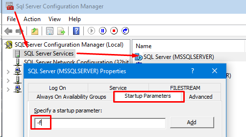
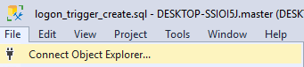
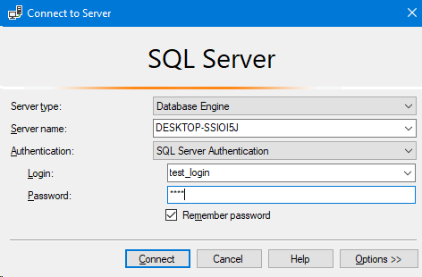

# Laborator 2 la Securitatea BD

A elaborat: **Curmanschii Anton, IA1901.**

Tema: **Metode de audit a BD.**


## Sarcinile

1. Setați la tabelul CurmanschiiAnton_Student și CurmanschiiAnton_Profesor auditul la modificarea datelor (Insert, Update, Delete).
2. Setați la nivel de SQL Server auditul logon.
3. Setați la nivel de BD auditul activității DDL ce presupune modificarea schemei tabelelor
(adaugarea/modificare unei coloane, adaogarea/modificarea unei condiții de integritate).
4. Setați la nivel de BD auditul erorilor.
5. Setați la nivel de BD auditul modificării privilegiilor și utilizatorilor.


## Răspunsurile


### 1\. Setați la tabelul CurmanschiiAnton_Student și CurmanschiiAnton_Profesor auditul la modificarea datelor (Insert, Update, Delete).

Vom crea o tabelă care să țină datele, înregistrate când are loc orice interogare de tip `Insert, Update, Delete` pe tabelele CurmanschiiAnton_Student și CurmanschiiAnton_Profesor.
În primul rând consultăm documentația pentru a afla ce proprietăți putem accesa, ce informație avem la dispoziție într-un astfel de trigger. [Link la pagina documentației](https://docs.microsoft.com/en-us/sql/relational-databases/triggers/dml-triggers?view=sql-server-ver15).

<!-- clr triggers:
     https://sqlquantumleap.com/2017/08/07/sqlclr-vs-sql-server-2017-part-1-clr-strict-security/ -->
<!-- https://sqlquantumleap.com/2017/08/09/sqlclr-vs-sql-server-2017-part-2-clr-strict-security-solution-1/ -->

Vom crea o tabelă care să stocheze acțiunea ce am aplicat, numele de login de pe care a fost executată acțiunea (folosind `suser_name()`), și câte coloane au fost atinse de această acțiune.
Funcția `object_id` returnează `null` dacă obiectul nu există. Am pus această clauză pentru ca să nu avem niciodată erori când executăm scriptul. N-urile înainte de literalele șirurilor după logică nu fac nimic în acest caz, deoarece avem de fapt un șir ASCII, iar codificare Unicode implicită este UTF-8, care este egală cu codificare ASCII în acest caz.

```sql
use Universitate
go

if object_id(N'dbo.StudentAndProfessor_InsertUpdateDelete_AuditTable', N'U') is null
    create table StudentAndProfessor_InsertUpdateDelete_AuditTable (
        id                              int not null primary key
                                        identity(1, 1), -- autoincrement
        name_of_user_who_did_action     nvarchar(max) not null,
        type_of_action                  char(1) not null, -- I, U or D
        affected_row_count              int not null)
    go
```

Acum creez trigger-ul pentru tabela `Student`.

```sql
create or alter trigger Student_InsertUpdateDelete_Trigger
on CurmanschiiAnton_Student
after insert, update, delete
as
begin
```

Folosesc `@@rowcount` pentru a înregistra câte rânduri a adăugat operația de insert, sau câte rânduri a modificat operația de update, sau câte rânduri a șters operația de delete.

```sql
declare @affected_row_count int = @@rowcount;
```

Folosesc un *early return* dacă nu s-a afectat nici un rând.

```sql
if @affected_row_count = 0
    return;
 ```

După aceasta determin tipul de operație, inspectând tabelele *inserted* și *deleted*.
*Inserted* conține rândurile nou-inserate, *deleted* conține rândurile șterse. 
În cazul în care operația este *update*, *inserted* va conține valorile noi, iar *deleted* va conține valorile vechi.
Ambele tabele vor conține mai mult decât o singură valoare numai dacă operația este *update*.
În alt caz, operația corespunde tabelei.

```sql
declare @type_of_action char(1);
if exists(select * from inserted)
    if exists(select * from deleted)
        set @type_of_action = 'U';
    else
        set @type_of_action = 'I';
else
    set @type_of_action = 'D';
```

Folosesc funcția `suser_name()` pentru a obține numele de login de pe care a fost realizată operația.

```sql
declare @login_name nvarchar(max) = suser_name();
```

În sfârșit, se adaugă o înregistrare în tabela de audit.

```sql
insert into StudentAndProfessor_InsertUpdateDelete_AuditTable (
    name_of_user_who_did_action,
    type_of_action,
    affected_row_count)
values (
    @login_name,
    @type_of_action,
    @affected_row_count);
```


Întreaga funcție:

```sql
create or alter trigger Student_InsertUpdateDelete_Trigger
on CurmanschiiAnton_Student
after insert, update, delete
as
begin
    -- https://docs.microsoft.com/en-us/sql/t-sql/statements/set-nocount-transact-sql?redirectedfrom=MSDN&view=sql-server-ver15
    -- set nocount on;

    -- https://docs.microsoft.com/en-us/sql/t-sql/functions/rowcount-transact-sql?view=sql-server-ver15
    -- https://www.mssqltips.com/sqlservertip/6091/how-to-use-rowcount-in-sql-server/
    declare @affected_row_count int = @@rowcount;

    if @affected_row_count = 0
        return;

    declare @type_of_action char(1);
    if exists(select * from inserted)
        if exists(select * from deleted)
            set @type_of_action = 'U';
        else
            set @type_of_action = 'I';
    else
        set @type_of_action = 'D';

    -- https://docs.microsoft.com/en-us/sql/t-sql/functions/suser-name-transact-sql?view=sql-server-ver15
    declare @login_name nvarchar(max) = suser_name();

    insert into StudentAndProfessor_InsertUpdateDelete_AuditTable (
        name_of_user_who_did_action,
        type_of_action,
        affected_row_count)
    values (
        @login_name,
        @type_of_action,
        @affected_row_count);
end
go
```

Pentru test, am implementat o procedură ce adaugă 5 înregistrări în tabela `Student`, verifică dacă s-a adăugat 5 rânduri în tabela respectivă pentru audit, după ce șterge aceste 5 înregistrări, verificând dacă s-a adăugat încă un rând în tabela de audit.
Deoarece nu am pus autoincrement la id-ul la studenți, trebuie să fac acea șmecherie cu ciclul.

```sql
create or alter procedure Students_InsertUpdateDelete_Test
as
begin
    set nocount on;

    -- essentially recreate the table.
    delete from StudentAndProfessor_InsertUpdateDelete_AuditTable where id >= 0;

    declare @max_student_id int;
    declare @added_students int = 5;

    begin
        -- store this, we will need it.
        select @max_student_id = max(id) from CurmanschiiAnton_Student;

        declare @loop_i int = 0;
        while @loop_i < @added_students
        begin
            insert into CurmanschiiAnton_Student (
                id, 
                nume, 
                prenume,
                an_nastere, 
                an_studii, 
                id_facultate)
            values (
                @loop_i + @max_student_id + 1,
                'RandomName',
                'RandomName2',
                cast('1999-06-09' as date),
                2,
                1);
            set @loop_i = @loop_i + 1;
        end
    end

    begin
        -- we should see 5 things in the table
        declare audit_cursor cursor for
        select type_of_action, affected_row_count from StudentAndProfessor_InsertUpdateDelete_AuditTable
        open audit_cursor;

        declare @type_of_action char(1);
        declare @affected_row_count int;
        declare @counter int = 0;
        declare @fail_flag int = 0;

        fetch next from audit_cursor into @type_of_action, @affected_row_count;
        while @@FETCH_STATUS = 0
        begin
            if @type_of_action != 'I'
            begin
                print 'Failure! Expected action I, got ' + @type_of_action;
                set @fail_flag = 1;
            end
            if @affected_row_count != 1
            begin 
                print 'Failure! Expected affected row count = 1, got ' + @affected_row_count;
                set @fail_flag = 1;
            end
            set @counter = @counter + 1;

            fetch next from audit_cursor into @type_of_action, @affected_row_count;
        end
        close audit_cursor;
        deallocate audit_cursor;

        if @counter != @added_students
        begin
            print formatmessage('Failure! Expected there to be %d messages, got %d.', 
                @added_students, 
                @counter)
            return;
        end

        if @fail_flag != 0
            return;
    end

    delete from CurmanschiiAnton_Student where id >= 5

    begin
        -- validate the count
        begin
            declare @audit_row_count int;
            select @audit_row_count = count(*)
            from StudentAndProfessor_InsertUpdateDelete_AuditTable;

            if @audit_row_count != @added_students 
                + 1 -- the one row added because of the deletion
            begin
                print formatmessage('Failure! Deletion added an amount of row different from 1. Had %d rows, expected %d.',
                    @audit_row_count,
                    @added_students + 1);
                return;
            end
        end
        
        -- mssql does not have scopes, literally unusable
        -- declare @type_of_action char(1);
        -- declare @affected_row_count int;

        select top 1 
            @type_of_action     = type_of_action, 
            @affected_row_count = affected_row_count
        from StudentAndProfessor_InsertUpdateDelete_AuditTable
        order by id desc;

        if @type_of_action != 'D'
        begin
            print 'Failure! Expected action type D, got ' + @type_of_action;
            return;
        end

        if @affected_row_count != @added_students
        begin
            print formatmessage('Failure! Expected %d row deleted, got %d',
                @added_students,
                @affected_row_count);
            return;
        end
    end
end
go
```

Acum apelăm procedura. Dacă nu afișează nimic, atunci trigger-ul a lucrat corect.

```sql
exec Students_InsertUpdateDelete_Test
```

```
Started executing query at Line 1
   Commands completed successfully. 
Total execution time: 00:00:00.033
```

Putem inspecta tabela de audit pentru a ne găsi cele 6 mesaje.

```sql
select * from StudentAndProfessor_InsertUpdateDelete_AuditTable
```

| id  | name_of_user_who_did_action | type_of_action | affected_row_count |
|-----|-----------------------------|----------------|--------------------|
| 146 | DESKTOP-SSIOI5J\Anton       | I              | 1                  |
| 147 | DESKTOP-SSIOI5J\Anton       | I              | 1                  |
| 148 | DESKTOP-SSIOI5J\Anton       | I              | 1                  |
| 149 | DESKTOP-SSIOI5J\Anton       | I              | 1                  |
| 150 | DESKTOP-SSIOI5J\Anton       | I              | 1                  |
| 151 | DESKTOP-SSIOI5J\Anton       | D              | 5                  |


Să facem și un mic test pentru update:

```sql
update CurmanschiiAnton_Student
set nume = 'Viorel'
where id >= 2
```

```
Started executing query at Line 5
   (1 row affected) 
   (3 rows affected) 
Total execution time: 00:00:00.013
```

```sql
select * from StudentAndProfessor_InsertUpdateDelete_AuditTable
where type_of_action = 'U'
```

| id  | name_of_user_who_did_action | type_of_action | affected_row_count |
|-----|-----------------------------|----------------|--------------------|
| 152 | DESKTOP-SSIOI5J\Anton       | U              | 3                  |


Pot face același lucru și pentru tabela Profesor, dar sper că ideea și așa deja este clară.
Pur și simplu aș copia codul și schimba unele denumirile câmpurilor și ale tabelelor.

Este clar că sarcina a fost realizată pentru demonstrație, așa tabelă sigur nu va avea valoarea practică în viață reală, dar conceptul poate fi util.

Acum voi scoate trigger-ul, deoarece nu este util:

```sql
use Universitate
go
drop trigger Student_InsertUpdateDelete_Trigger
```

```
Started executing query at Line 1
    Commands completed successfully. 
Started executing query at Line 3
    Commands completed successfully. 
Total execution time: 00:00:00.007
```


### 2\. Setați la nivel de SQL Server auditul logon.

<!-- https://docs.microsoft.com/en-us/sql/t-sql/statements/execute-as-transact-sql?view=sql-server-ver15 -->

Un login trigger este depistat când are loc o conectare pe server.
Conectările vin de la login-uri.
Deci ca să putem verifica triggerul, trebuie să avem un login test de pe care să ne logăm (am putea folosi autentificare default, dar cred că un login aparte ar fi util).

Serverul SQL implicit admite doar conectarea Windows, dar noi am vrea să ne conectăm cu un login SQL simplu.
Pentru aceasta facem următoarele acțiuni:

- Schimbăm setarea modului de login la login mixt;
- După aceasta, restartăm serverul.

<style>
    img[alt^="small"] { width: 300px; }
</style>


Acum putem loga cu un login SQL.
La început, ne creăm un login pentru test.
Eu am făcut o procedură care șterge acest login dacă deja există, inchizând toate sesiunile curente (nu putem șterge pe un utilizator în timpul în care este logat).
Ideea am luat-o din [acest răspuns](https://stackoverflow.com/a/29911657/9731532).
După aceasta se crează un login fără privilegii (doar connect).

> Creating a login automatically enables the new login and grants the login the server level CONNECT SQL permission. (din documentația MS).

```sql
create or alter procedure ReCreateTestLogin(
    @login_name nvarchar(max))
as
begin
    if exists(
        select name
        from sys.server_principals
        where name = @login_name)
    begin
        declare login_connections_cursor cursor
        for select session_id 
            from sys.dm_exec_sessions
            where login_name = @login_name;
        open login_connections_cursor;

        declare @session_id smallint;

        fetch next 
        from login_connections_cursor
        into @session_id;

        while @@fetch_status = 0
        begin
            exec('kill ' + @session_id);

            fetch next 
            from login_connections_cursor
            into @session_id;
        end

        close login_connections_cursor;
        deallocate login_connections_cursor;

        exec sp_droplogin @login_name;
    end

    exec sp_addlogin @login_name, '1111';
end
```

Acum creăm totul necesar pentru un trigger:

- Când un login se conectează la server, vom sălva adresa IP a lui, numele de utilizator, și data de logare.
- Dacă se loghează un admin, acceptăm imediat.
- Dacă numele conține `hacker`, nu vom accepta conexiunea.
- Permitem doar 15 încercări de logare (reușite sau nereușite) în 5 minute.
- Permitem doar 3 sesiuni concomitente.
- Încă vom sălva dacă utilizatorul a fost admis de declanșator. 

Clar că cerințele sunt destul de arbitrare, dar vor demonstra logica mai bine.

> După înțelegerea mea, încercări de conectare cu parola eșuată nu pot fi procesate de declanșatoare personalizate, 
> deoarece login-uri cu parole incorecte eșuează înainte ca declanșatoarele să fie rulate.
> Declanșatoarele sunt rulate numai după ce a trecut validarea inițială de server.


Crearea declanșatoarelor de logon este destul de periculoasă, deoarece dacă o eroare se întâmplă înăuntru unui din ele, 
veți putea fi blocate de logare.
De exemplu, în cazul meu un pic am greșit cu vizibilitatea tabelului, prin urmare nu puteam accesa tabela de audit dinăuntru declanșatorului meu, și nu puteam loga.
De aceea trebuie să cunoașteți ce puteți face ca să primiți accesul înapoi.

Prima sugestie a mea este să țineți o conectare deschisă în scriptul unde definiți declanșatorul.
Astfel veți putea să-l scoateți cum un `drop trigger`, dacă vedeți că ceva nu iese corect, sau să-l modificați ușor, verificând schimbările noi în cod (ați schimba codul scriptului, îl rerula, creând triggerul din nou, iar pe urmă încercând o logare nouă de pe contul test).

Dacă deja ați închis sesiunea și nu deja puteți loga, dar vreți să scoateți triggerul, adăugați [flagul `-f`](https://docs.microsoft.com/en-us/sql/database-engine/configure-windows/database-engine-service-startup-options?view=sql-server-ver15#other-startup-options) în startup la *SQL Server Configuration Manager*, ca pe imagine:



Opțiunea `-f` pune serverul în "configurația minimă", ceea ce înseamnă că nici un trigger nu va fi apelat la logare și că se permite numai o singură conexiune deodată.
Acum puteți da restart la server (right click pe *SQL Server (MSSQLSERVER)* și restart).

Închideți SSMS, deoarece din el nu veți putea scoate trigger-ul, deoarece el deschide mai multe conexiuni la server, de aceea trebuie să folosiți linia de comandă.
Scrieți `sqlcmd -Q "drop trigger TRIGGER_NAME on all server"` ca să vă scoateți trigger-ul de logare.
`sqlcmd` permite executarea comenzilor T-SQL, opțiunea `-Q` înseamnă "execute and close connection", "on all server" este necesară deoarece declanșatoarele de logare sunt globale pentru întregul server.


Cu toate că am făcut destul de mult setup, nu suntem încă gata să creăm declanșatorul.
Codul declanșatoarelor este rulat în context-ul unui login, stocat în baza de date.
Deoarece vrem să facem audit, adică să stocăm unele date într-o tabelă personalizată, trebuie să definim acest context pentru declanșator de logon, ca el să vadă tabelul acesta.
În codul declanșatorului eu voi accesa și tabelele de sistem și tabelele DMO, de aceea trebuie să dau utilizatorului nou și privilegiul `view server state` ca să le poată accesa.
<!-- NOPE does not work like this, confirmed! -->
<!-- Putem și să-i scoatem privilegiul de logare, deoarece acest login doar dă context-ul pentru declanșator, nu-i utilizat pentru conexiuni la server reale. -->
Ca să dăm privilegiul de modificare a tabelei personalizate de audit (avem nevoie de *select* și *insert*), vom avea nevoie să creăm și un utilizator be baza acestul login.
În alt caz, tabela nici nu va fi vizibilă în corpul declanșatorului, și el mereu ar da o eroare.

Este important să țineți minte că nu puteți, după configurări implicite, să ștergeți utilizatorul creat cu `sp_adduser` simplu cu `drop user USER_NAME`, deoarece el atunci ar fi proprietarul unei scheme (este un namespace în scopul unei baze de date, după înțelegerea mea; nu le-am folosit). 
Utilizați `sp_dropuser` în loc de aceasta.

Definesc această procedură, dar încă nu o execut, deoarece încă nu am creat tabela.

```sql
-- We need a user to provide context to the trigger.
-- Otherwise it cannot see or query any tables.
create or alter procedure MaybeCreateLogonTriggerContextLogin
as
begin
    if exists(
        select name 
        from sys.server_principals
        where name = 'logon_trigger_context_login')
    begin
        return;
    end

    exec sp_addlogin 'logon_trigger_context_login', 'q9u7hy8u3i%^#&*^*sSFJAPOQ';
    
    -- Needed for it to query dm_* tables (DMO's), I think.
    -- System tables are included in this too, I think.
    grant view server state
    to logon_trigger_context_login;

    -- Need a user to be able to insert into user tables.
    exec sp_adduser 'logon_trigger_context_login', 'logon_trigger_context_user';

    -- Without this permission it won't be able to modify the table.
    grant select, insert
    on LogonMaster_AuditTable
    to logon_trigger_context_user;
end
```

Creez tabela pentru datele auditului, după ce deja putem crea context-ul:

```sql
if object_id(N'dbo.LogonMaster_AuditTable', N'U') is null
    create table LogonMaster_AuditTable (
        id                int not null primary key identity(1, 1),
        ip_address        nvarchar(max) not null,
        login_name        nvarchar(max) not null,
        logon_datetime    datetime not null,
        is_logon_allowed  bit not null)
go

exec MaybeCreateLogonTriggerContextLogin
go
```

Acum deja definim declanșatorul de logon.

```sql
create or alter trigger LogonMasterTrigger
on all server
with execute as 'logon_trigger_context_login'
for logon
as
begin
    -- There is another function that does the same.
    declare @ip_address nvarchar(max) = eventdata()
        .value('(/EVENT_INSTANCE/ClientHost)[1]', 'nvarchar(max)');

    declare @is_logon_allowed  bit           = 1;
    declare @login_name        nvarchar(max) = original_login();
    declare @logon_date        datetime      = getdate();

    -- Always let admins log on.
    if is_srvrolemember('sysadmin', @login_name) = 0
    begin
        -- Block hackers.
        if @login_name like '%hacker%'
        begin
            print formatmessage('Connection not allowed for "%s": hackers not allowed.', 
                @login_name, @login_name);
            set @is_logon_allowed = 0;
        end

        -- Get all logons that took place from that login in the last 5 minutes.
        if @is_logon_allowed = 1
        begin
            declare @connection_limit_duration_seconds int = 5 * 60;
            declare @connection_limit_max_logon_count  int = 15;
            declare @actual_logon_count int;

            select @actual_logon_count = count(*)
            from LogonMaster_AuditTable
            where datediff(second, logon_date, @logon_date) < @connection_limit_duration_seconds
                and login_name = @login_name;
            
            if @actual_logon_count >= @connection_limit_max_logon_count
            begin
                print formatmessage('Connection not allowed for "%s": too many connection attempts (max is %d, the current count is %d).', 
                    @login_name, @connection_limit_max_logon_count, @actual_logon_count);
                set @is_logon_allowed = 0;
            end
        end

        -- Check concurrent session count.
        if @is_logon_allowed = 1
        begin
            declare @max_concurrent_session_count smallint = 3;
            declare @actual_session_count smallint;

            select @actual_session_count = count(*)
            from sys.dm_exec_sessions
            where is_user_process = 1
                and original_login_name = @login_name

            if @actual_session_count > @max_concurrent_session_count
            begin
                print formatmessage('Connection not allowed for "%s": too many concurrent sessions (max is %d, the current count is %d).', 
                    @login_name, @max_concurrent_session_count, @actual_session_count);
                set @is_logon_allowed = 0;
            end
        end

        if @is_logon_allowed = 0
        begin
            -- We need to push the new data into the table after we deny the logon.
            -- https://docs.microsoft.com/en-us/sql/relational-databases/triggers/logon-triggers?view=sql-server-ver15#managing-transactions
            rollback transaction;
        end
    end

    insert into LogonMaster_AuditTable(
        ip_address,
        login_name,
        logon_date,
        is_logon_allowed)
    values (
        @ip_address,
        @login_name,
        @logon_date,
        @is_logon_allowed
    );
end
go
```

Acum putem verifica trigger-ul, realizând o conectare nouă în SSMS, de exemplu (însă SSMS nu-i un loc tare bun pentru aceste verificări, acuș explic de ce). 

La mine prima dată nu a lucrat, deoarece nu am creat un utilizator și declanșatorul nu vedea tabela de audit.
Puteți face debugging prin print-uri, toate mesajele se duc în fișier-ul cu loguri, în cazul meu se află după locația `C:\Program Files\Microsoft SQL Server\MSSQL15.MSSQLSERVER\MSSQL\Log\ERRORLOG`.





Dacă încercați aceasta cu codul meu, aveți șanse mari să vă dea o eroare! De ce? Dacă ne uităm în loguri, observăm mesajul:
```
2022-01-23 18:57:36.80 spid65      Connection not allowed for "test_login": too many concurrent sessions (max is 3, the current count is 4).
2022-01-23 18:57:36.80 spid65      Error: 3609, Severity: 16, State: 2.
2022-01-23 18:57:36.80 spid65      The transaction ended in the trigger. The batch has been aborted.
2022-01-23 18:57:36.80 Logon       Error: 17892, Severity: 20, State: 1.
2022-01-23 18:57:36.80 Logon       Logon failed for login 'test_login' due to trigger execution. [CLIENT: <local machine>]
```

Deci SSMS uneori deschide mai multe decât 3 conexiuni concomitente, încercând să acceseze serverul.
(Probabil deschide câte o conexiune nouă pentru fiecare mapa din object explorer, fiecare într-un nou thread?)

Asemănător, dacă încercați să vă conectați din nou de una sau de două ori, veți primi a doua eroare, că numărul de încercări era mai mare ca 15:
```
2022-01-23 19:25:54.04 spid53      Connection not allowed for "test_login": too many connection attempts (max is 15, the current count is 15).
2022-01-23 19:25:54.04 spid53      Error: 3609, Severity: 16, State: 2.
2022-01-23 19:25:54.04 spid53      The transaction ended in the trigger. The batch has been aborted.
2022-01-23 19:25:54.04 Logon       Error: 17892, Severity: 20, State: 1.
2022-01-23 19:25:54.04 Logon       Logon failed for login 'test_login' due to trigger execution. [CLIENT: <local machine>]
2022-01-23 19:25:59.77 spid53      Connection not allowed for "test_login": too many connection attempts (max is 15, the current count is 16).
2022-01-23 19:25:59.77 spid53      Error: 3609, Severity: 16, State: 2.
2022-01-23 19:25:59.77 spid53      The transaction ended in the trigger. The batch has been aborted.
2022-01-23 19:25:59.77 Logon       Error: 17892, Severity: 20, State: 1.
2022-01-23 19:25:59.77 Logon       Logon failed for login 'test_login' due to trigger execution. [CLIENT: <local machine>]
```

Putem examina tabela de audit pentru a afla despre încercări de logon.
Tabela în cazul meu a stat pentru mai mult timp, a stocat deja câteva înregistrări:

```sql
select * from LogonMaster_AuditTable
```

| id  | ip_address      | login_name            | is_logon_allowed | logon_date              |
|-----|-----------------|-----------------------|------------------|-------------------------|
| 147 | <local machine> | test_login            | 1                | 2022-01-23 19:23:40.530 |
| 148 | <local machine> | test_login            | 1                | 2022-01-23 19:23:40.553 |
| 149 | <local machine> | test_login            | 1                | 2022-01-23 19:23:40.560 |
| 150 | <local machine> | test_login            | 1                | 2022-01-23 19:23:40.563 |
| 151 | <local machine> | test_login            | 1                | 2022-01-23 19:23:40.573 |
| 152 | <local machine> | test_login            | 0                | 2022-01-23 19:23:40.573 |
| 153 | <local machine> | test_login            | 0                | 2022-01-23 19:23:40.663 |
| 154 | <local machine> | test_login            | 0                | 2022-01-23 19:23:54.763 |
| 155 | <local machine> | test_login            | 1                | 2022-01-23 19:23:54.773 |
| 156 | <local machine> | test_login            | 0                | 2022-01-23 19:23:54.860 |
| 157 | <local machine> | DESKTOP-SSIOI5J\Anton | 1                | 2022-01-23 19:24:01.873 |
| 158 | <local machine> | DESKTOP-SSIOI5J\Anton | 1                | 2022-01-23 19:24:01.890 |
| 159 | <local machine> | DESKTOP-SSIOI5J\Anton | 1                | 2022-01-23 19:24:01.900 |
| 160 | <local machine> | DESKTOP-SSIOI5J\Anton | 1                | 2022-01-23 19:24:01.907 |
| 161 | <local machine> | DESKTOP-SSIOI5J\Anton | 1                | 2022-01-23 19:24:01.917 |
| 162 | <local machine> | DESKTOP-SSIOI5J\Anton | 1                | 2022-01-23 19:24:01.920 |
| 163 | <local machine> | DESKTOP-SSIOI5J\Anton | 1                | 2022-01-23 19:24:01.920 |
| 164 | <local machine> | DESKTOP-SSIOI5J\Anton | 1                | 2022-01-23 19:24:01.930 |
| 165 | <local machine> | DESKTOP-SSIOI5J\Anton | 1                | 2022-01-23 19:24:01.997 |
| 166 | <local machine> | DESKTOP-SSIOI5J\Anton | 1                | 2022-01-23 19:24:02.007 |
| 167 | <local machine> | DESKTOP-SSIOI5J\Anton | 1                | 2022-01-23 19:24:02.020 |
| 168 | <local machine> | DESKTOP-SSIOI5J\Anton | 1                | 2022-01-23 19:24:02.037 |
| 169 | <local machine> | DESKTOP-SSIOI5J\Anton | 1                | 2022-01-23 19:24:02.057 |
| 170 | <local machine> | DESKTOP-SSIOI5J\Anton | 1                | 2022-01-23 19:24:02.123 |
| 171 | <local machine> | DESKTOP-SSIOI5J\Anton | 1                | 2022-01-23 19:24:02.133 |
| 172 | <local machine> | DESKTOP-SSIOI5J\Anton | 1                | 2022-01-23 19:24:02.150 |
| 173 | <local machine> | test_login            | 0                | 2022-01-23 19:24:09.473 |
| 174 | <local machine> | test_login            | 1                | 2022-01-23 19:24:09.483 |
| 175 | <local machine> | test_login            | 0                | 2022-01-23 19:24:09.550 |
| 176 | <local machine> | test_login            | 1                | 2022-01-23 19:25:31.333 |
| 177 | <local machine> | test_login            | 0                | 2022-01-23 19:25:31.397 |
| 178 | <local machine> | test_login            | 0                | 2022-01-23 19:25:54.040 |
| 179 | <local machine> | test_login            | 0                | 2022-01-23 19:25:59.777 |

Putem șterge toate înregistrările:
```sql
delete from LogonMaster_AuditTable
```

Peste câteva minute, încercăm din nou, observând că deja nu primim erorile de numărul excesiv de încercări.

Trigger-ul creat de mine este destul de inutil, și chiar face utilizarea lui SSMS anevoioasă, de aceea îl scoatem.
```sql
drop trigger LogonMasterTrigger on all server
```

### 3\. Setați la nivel de BD auditul activității DDL ce presupune modificarea schemei tabelelor (adaugarea/modificare unei coloane, adaugarea/modificarea unei condiții de integritate).


### 4\. Setați la nivel de BD auditul erorilor.
### 5\. Setați la nivel de BD auditul modificării privilegiilor și utilizatorilor.